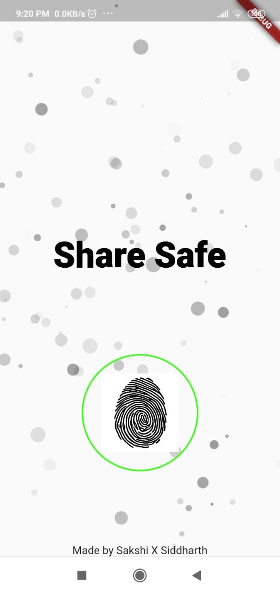

# Apptitude_acm

## Team Dev.exe

### Demo


### ScreenShots
1. Welcome Screen


2. Biometric Auth Screen


3. QR Screen


### Problem Statement
1. Biometric Authentication
2. Implementation of QR Code generation
3. Communication between 2 devices locally

### Smart Share

* What is Encryption ?
'''The process of converting information or data into a code, especially to prevent unauthorized access.'''
1. There are many situations where we cant say certain things in public.
2. Use smart share, type what you want and generate a QR Code and just ask the other person to scan it
3. Now that person can get the information on his screen.
4. The text is copyable which makes it easier to use

### Instructions to run
```
1. Run the app, it will ask you for basic permissions.
2. Now it will allow you to generate or scan messages only if you allow it to use your fingerprint.
3. The app uses the fingerprints you already have in your phone.
